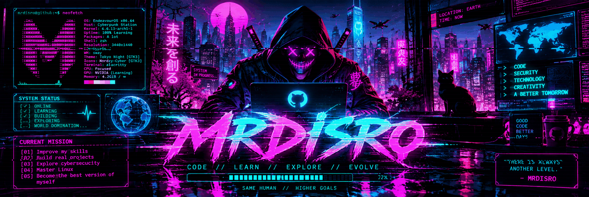

<div align="center">



# ⚡ MRDISRO.. SYSTEM ONLINE 🟢

`CODE` • `LEARN` • `EXPLORE` • `EVOLVE`

</div>

---

## `> whoami`

```bash
$ whoami
GJ

$ alias
MrDisro

$ status
[ ONLINE ]
[ LEARNING ]
[ BUILDING ]
[ EXPLORING... ]
```

🧠 Learning to code  
💻 Exploring technology & cybersecurity  
🐧 Learning Linux  
⚡ Building my first serious projects

---

## `> current_mission`

```text
[01] Improve my skills
[02] Build real projects
[03] Explore cybersecurity
[04] Master Linux
[05] Become a better developer
```

> There is always another level.

---

## `> tech_stack`

```text
╭────────────────────────────────────╮
│          CURRENT LOADOUT           │
├────────────────────────────────────┤
│ 🐍 Python          Learning        │
│ 🌐 Web Development Learning        │
│ 🐧 Linux           Exploring       │
│ 🔐 Cybersecurity   Exploring       │
│ 🧠 Git / GitHub    Learning        │
╰────────────────────────────────────╯
```

---

## `> projects`

```text
STATUS: BUILDING...
```

🚧 My projects are currently loading.

Check back soon — this section will become the main showcase for my work.

---

## `> interests`

`⚡ Cyberpunk` `💻 Programming` `🔐 Cybersecurity` `🐧 Linux`  
`🌐 Web` `🤖 AI` `🎮 Gaming` `🧩 Problem Solving`

---

## `> github_stats`

<div align="center">


<br>


<br>


</div>

---

## `> connect`

<div align="center">

<a href="https://github.com/Garret0J">
  
</a>

</div>

---

<div align="center">

```text
╔══════════════════════════════════════════════╗
║                                              ║
║              MRDISRO.. ONLINE 🟢            ║
║                                              ║
║       CODE // LEARN // EXPLORE // EVOLVE    ║
║                                              ║
╚══════════════════════════════════════════════╝
```

**`THERE IS ALWAYS ANOTHER LEVEL.`**

</div>
